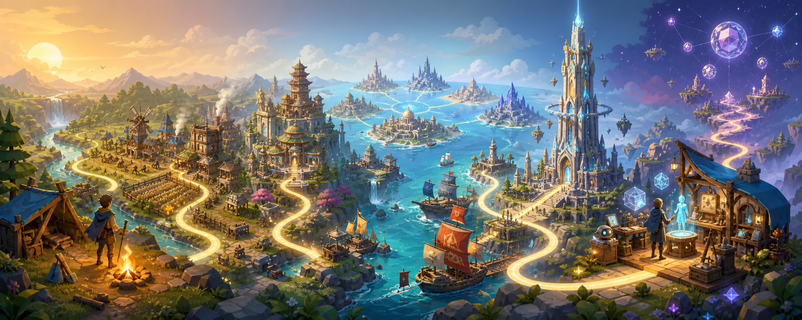

# Freetower

**建设自由的加密岛🏝️**

[English](./README.md) | 简体中文

## 关于 Freetower

Freetower 是一款以比特币原生身份为长期设计方向的七文明建设与开放世界创造游戏。

长期设想是：从远古神话文明出发，亲手创造只有这个文明才能走出的未来。七个文明共享生存、生产、建设、探索、科技和时代升级的基础玩法，但各自沿着不同的文化与神话方向进化。

项目正在围绕这一方向进行整理。本 README 不宣布公开 MMO、在线运营服务或投资产品。

## 当前开发状态

Freetower 当前处于规划阶段，正在计划、创建、拆分和排序开发任务，为下一阶段实现做准备。

目前仓库中的所有开发代码均由 Codex 完成，不具备实际应用价值。

## 核心玩法

第一步要证明的是游戏本身是否好玩：

```text
探索
  ↓
采集
  ↓
生存
  ↓
制造
  ↓
建设
  ↓
发展聚落
  ↓
解锁科技
  ↓
探索更远区域
  ↓
推动文明升级
```

计划中的基础玩法包括：

- 资源采集
- 生存
- 制造
- 建筑建造
- 聚落发展
- 世界探索
- 遗迹探索
- NPC 任务
- 神话生物
- 科技研究
- 文明进化

以上是计划中的玩法目标，不代表当前已经实现。

## 七大神话文明

七个文明是在统一玩法底层上的七条独立文明进化路线，不是七款互不相关的游戏，也不是简单换皮。

| 文明 | 未来科技方向 | 长期视觉方向 |
| --- | --- | --- |
| 中华神话文明 | 仙道科技 | 悬浮仙宫、龙脉能源、机关兽、御剑交通 |
| 日本神话文明 | 赛博神道 | 赛博神社、量子鸟居、AI 巫女、机械武士 |
| 印度神话文明 | 梵天宇宙科技 | 悬浮神庙、轮回科技、元素能源 |
| 北欧神话文明 | 符文科技 | 机械世界树、光能维京舰、雷霆能源 |
| 希腊神话文明 | 神谕科技 | 悬浮奥林匹斯、AI 神谕、天空神殿 |
| 埃及神话文明 | 太阳科技 | 悬浮金字塔、太阳能源、光能方尖碑 |
| 美洲原住民神话文明 | 自然灵能科技 | 生命之树城市、自然 AI、灵魂网络 |

以上是长期内容方向，不表示七个文明当前都可以游玩。

## 文明进化

每个文明计划沿着统一的时代序列发展：

```text
远古时代
  ↓
部落时代
  ↓
城邦 / 王国时代
  ↓
工业时代
  ↓
现代科技时代
  ↓
未来文明时代
  ↓
神话科技巅峰时代
```

时代升级不只是数值增加。随着时代推进，建筑、道路、照明、交通、生产设施、NPC 外观、音乐、环境、科技表现和城市规模都应逐步改变。

> 未来科技不能抹去文明文化，而是让文明文化继续进化。

## 世界结构

### 个人文明领地

玩家拥有稳定的个人领地，用于生存、采集、建设、生产、探索、科技研究、遗迹探索、NPC 任务和文明成长。长期个人建设不以被其他玩家无限制摧毁为设计目标。

### 文明公共世界

未来同文明玩家可以共同建设文明奇观、公共港口，研究文明科技，完成文明任务，建设舰队，参与大型神话事件和结构化排名。

### Freetower 世界

Freetower 位于七文明中央海域。游戏早期可以远观但不能进入。它是世界核心地标、七文明共同谜团、长期发展目标，也是后期多人内容的计划入口。

开放后，Freetower 可能承载跨文明社交、多人任务、玩家空间、AI NPC、世界事件、跨文明市场、玩家创作和经批准的 Ordinals 资产互动。这些都是计划系统，不是当前功能。

## 文明多人系统

**计划 / 长期：**

- 公共建设与文明奇观
- 共享研究与公共港口
- 舰队建设与文明事件
- 神话生物遭遇
- 建筑、探索、科技、贸易、航海和创作排名
- 限时挑战

多人竞争应当是结构化、赛季化的，不允许无限制摧毁其他玩家的个人领地。

## 贸易与海洋探索

**计划中：**

```text
近海探索
  ↓
跨文明航线
  ↓
文明舰队
```

长期内容可能包括小型船只、海洋探索、打捞、岛屿、海怪、贸易路线、护航任务、舰队建设、海战、NPC 商队、玩家订单、文明订单、稀有资源、航运和贸易声望。

Freetower 不需要为了贸易发行新的游戏代币。

## 文明竞争

**长期愿景：**

1. 贸易战
2. 科技竞赛
3. 文化竞争
4. 军事冲突

军事冲突计划主要发生在海洋、资源岛、独立战区、航运路线、海军据点和世界事件中，采用赛季、匹配或事件制，而不是允许玩家随时抹除其他玩家主城。

## 开启 Freetower

Freetower 计划通过世界事件开放，而不是简单的玩家等级奖励。长期条件可能包括：

- 七个文明达到要求的时代阶段
- 文明港口和公共舰队完成
- 贸易路线建立
- 世界任务完成
- Freetower 遗物收集
- 高塔能量恢复
- 七文明共同完成开放事件

## Freetower 多人世界

开放后的高塔计划成为共享世界，包含高塔楼层、跨文明活动、社交空间、玩家空间、世界事件和后续创作系统。当前本地原型尚未开放它。

## AI 玩家创作

**计划 / 长期：** AI 未来可以协助玩家创作装备、物品、NPC、任务、房间、地图、事件和玩法规则。

AI 不得直接生成未经控制的可执行代码，也不得直接写入权威游戏状态。预期流程是：

```text
玩家想法
  ↓
AI 结构化草稿
  ↓
规则校验
  ↓
平衡校验
  ↓
安全校验
  ↓
玩家修改
  ↓
审核
  ↓
发布
```

## Contribution 贡献值

Contribution 是长期的、绑定身份的贡献认可系统，不是代币，不能交易或转移。它应来自可审计的贡献事件，例如文明建设、世界事件、玩家创作的玩法和任务、物品、指南、被采纳的提案以及经过验证的社区价值。

单纯点赞不会直接产生 Contribution。私信和普通聊天不会产生 Contribution。AI 不能独立决定 Contribution。

## 比特币原生身份

**计划 / 长期集成：**

```text
连接钱包
  ↓
验证所有权
  ↓
验证角色资产
  ↓
验证 .btc
  ↓
创建角色身份
  ↓
选择文明
  ↓
进入世界
```

长期设定是 `Wallet = Account`：支持的钱包、符合条件的 Ordinals/NFT 角色资产和有效 `.btc` 域名共同组成正式准入条件；`.btc` 作为公开角色名称。这些是未来产品规则，不代表当前本地原型已经生产就绪或所有 Provider 已上线。

## Ordinals 与比特币资产

**长期愿景：** 未来可能支持 Ordinals 角色、宠物、装备、物品、Runes 资产、`.btc` 名称、比特币原生收藏品和经过批准的外部集合。

任何未来资产都必须经过：

```text
协议验证
  ↓
钱包所有权验证
  ↓
集合资格验证
  ↓
元数据校验
  ↓
内容安全校验
  ↓
游戏映射
  ↓
版本兼容性
  ↓
激活
```

Freetower 不采用“钱包里有什么，就自动变成游戏物品”的规则。

## 链上与游戏服务器边界

Bitcoin 和其他链适合承载所有权、资产身份、稀缺性、重要凭证和公开证明。

游戏服务器适合承载位置、战斗、建筑进度、任务状态、冷却、排名、聊天、临时资源和实时玩法。

Bitcoin 管理身份、所有权和重要证明；游戏服务器管理高频游戏状态。Freetower 不会试图把每次移动、攻击或建造操作写入 Bitcoin。

## 产品路线图

不承诺具体发布日期。



这张概念图以视觉方式表达从营地与聚落，到文明协作、海洋航线、Freetower、结构化 AI 创作和未来身份层的长期方向。它是概念图，不代表当前功能已实现。

### Phase 1 — 生存与文明建设原型

第三人称探索、资源采集、生存、制造、建筑建造、聚落发展、探索和文明基础框架。

### Phase 2 — 七文明扩展

七种环境、文明建筑、神话 NPC、神话生物、文明资源、文明进化和文明专属内容。

### Phase 3 — 文明多人系统

文明公共世界、合作建设、排名、文明事件和共享研究。

### Phase 4 — 港口、贸易与海洋

港口、船只、海洋探索、贸易、航运、岛屿和海洋生物。

### Phase 5 — 文明竞争

贸易、科技、文化和海军竞争，以及文明赛季。

### Phase 6 — 跨文明世界事件

多文明任务、世界首领、Freetower 谜团、遗物和高塔激活事件。

### Phase 7 — Freetower 多人世界

高塔楼层、社交系统、跨文明内容、玩家空间和世界活动。

### Phase 8 — AI 创作生态

AI 装备、任务、NPC、地图、玩家创作玩法和创作者系统。

### Phase 9 — Bitcoin / Ordinals 集成

钱包身份、`.btc`、角色映射、宠物映射、装备映射和比特币资产验证。

### Phase 10 — 持续开放世界

文明赛季、玩家治理、世界事件、玩家创造的世界和获批准的外部 Ordinals 集成。

## 当前优先级

1. 建设是否有趣
2. 生存循环是否成立
3. 探索是否有吸引力
4. 文明升级是否有成长感
5. 美术方向与时代变化是否有视觉吸引力
6. 多人系统
7. AI 创作
8. Bitcoin / Ordinals

**游戏首先必须好玩。**

## 开发状态

- 🚧 **规划中：** 正在为生存建设原型定义并创建开发任务。
- 🧭 **计划中：** 实现统一玩法循环、独立 3D 运行时、七文明进化、多人系统、AI Creator 生态和 Bitcoin / Ordinals 集成。

本 README 不将任何功能标记为新的生产就绪实现。

## 参与项目

Freetower 当前正在规划和创建开发任务，贡献规范将在核心玩法和项目架构稳定后进一步完善。

修改仓库前请先阅读 [AGENTS.md](./AGENTS.md)，保留已有工作，并在 Pull Request 中说明实际运行过的验证和仍未完成的边界。

## License

项目许可证将在发行与开源策略确定后补充。
