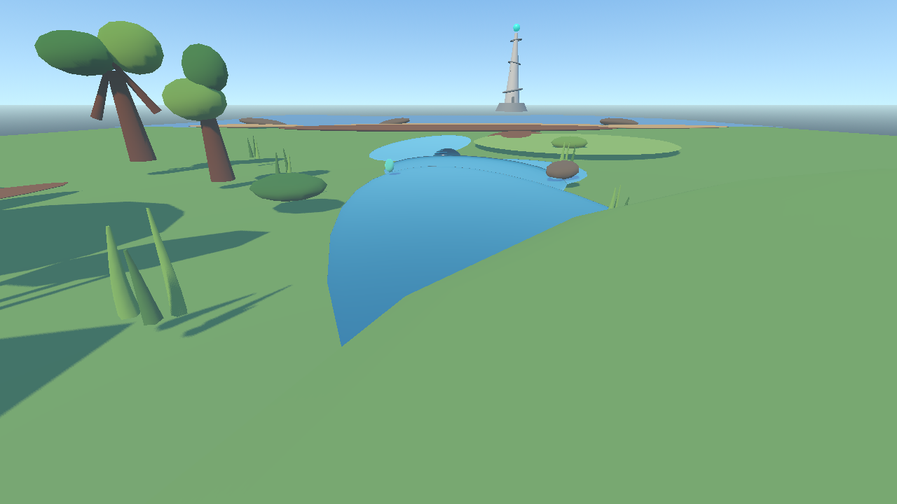
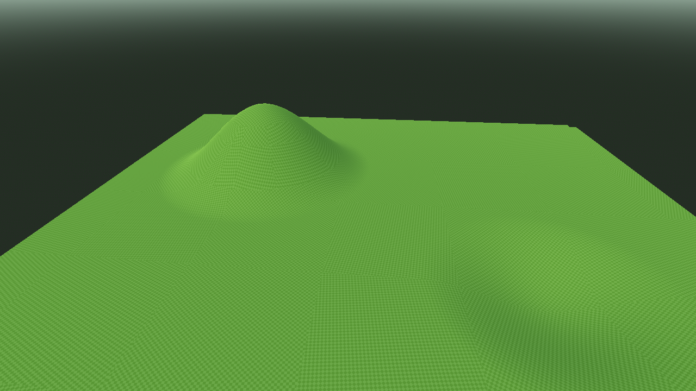

# Free Tower 开发日志 #001 —— 从“让 AI 画地图”到建立真正的世界构建工具链

[English](./README.md)

## 为什么重新设计流程

Free Tower 正在以“人类主导、AI 协作”的方式重建。我们的目标并不是让 Agent 自主地“把游戏做完”。产品方向、玩法、架构、美术方向、视觉验收和重大技术决策始终由人类负责；Codex 执行范围明确、能够检查、能够回溯的工程任务。

一开始我们遇到的问题不是 Godot 不能运行，而是地图虽然技术正确，却不像一款真正的游戏。

## 第一张 Godot Whitebox

FT-GD-001 建立了 Godot 4.6 工程基础和约 100 m × 100 m 的 Vertical Slice，包含出生草地、森林、石丘、河流、海岸、古代遗迹和远处的 Free Tower 地标。

工程验收通过：Godot、Scene、地图空间关系、Runtime 和 Headless 都能正常工作。但 Human Visual Review 否决了结果。用户的真实反馈是：地图过于简陋，像由基础几何体拼成的测试场，缺少成熟游戏世界应有的视觉质量。

因此 FT-GD-001 的结论是：**技术通过，视觉否决。**

最初的技术白盒截图在开发过程中接受过审查，但目前没有存入公开 Devlog Pack。

## 用更多代码修补美术

FT-GD-001A 尝试把 Whitebox 推进到 Scenic Prototype：加入连续地形改进、弯曲河流与海岸过渡、草、程序化树木与岩石、Ancient Banyan proxy、遗迹、风格化水 Shader、Soft Toon 材质、更好的天空和灯光，以及重新设计的 Free Tower proxy。

这一次工程上再次通过，画面也比第一版复杂。但 Human Visual Review 再次否决：场景仍然过度依赖程序化 Proxy Art，没有达到 Free Tower 应有的视觉身份和成熟度。

FT-GD-001A 的结论同样明确：**技术通过，视觉再次否决。** Coding Agent 能改善几何、Shader 和 Scene 实现，却不会因此自动拥有 Environment Artist、Level Designer 或 Art Director 的判断力和生产资产。

## Concept Art 仍然不够

ART-001 把视觉探索转移到 image generation，共生成四张环境 Concept Art。它们在构图、氛围、自然环境、空间纵深以及森林和河流的可读性上都有明显提升。

但 Human Review 仍未批准。关键反馈是：画面缺少足够明确的 Bitcoin-native 表达，Free Tower 本身也没有真正建立“自由”的精神。

因此 ART-001 的正式状态是：**HUMAN REVIEW: REJECTED**。四张图只能作为 Exploration Reference，不是 Approved Production Ground Truth；它们位于 repository 外，本次没有公开原图。

## 工作流的改变

我们不再把“生成一张更漂亮的图”或“增加更多程序化 Mesh”当成地图生产能力，也不再要求 Codex 凭代码直接承担最终环境美术生产。

现在的流程是：

Human Design → Art Direction → World Builder → Real Terrain Tool → Asset Pipeline → Runtime Review → Human Approval

`free-tower-art-director` 负责视觉判断和审查边界；`free-tower-world-builder` 负责把人类批准的布局转化为可控的 Godot 世界。核心原则是 Human Layout + Procedural Naturalization，而不是 Random World Generation 或 Primitive-based scene drawing。

## Terrain3D Compatibility Spike

CAP-WORLD-001 选择 Terrain3D 作为候选地形系统，WORLD-001 随后在隔离项目中验证 Apple M4、Godot 4.6、macOS 与 Terrain3D `v1.0.2-stable` 的真实兼容性。

| 路径 | 实测 | 决策 |
| --- | --- | --- |
| Forward+ / Metal | 当前机器可运行 | Terrain3D 官方不支持，因此不批准 |
| Forward+ / Vulkan / MoltenVK | PASS | 批准为 macOS 开发路径 |
| Compatibility / OpenGL3 | 出现大面积黑色 Terrain | 当前开发机上否决 |

Vulkan 路径通过了 Editor、Runtime、3/3 独立启动、Raise / Lower、Smooth、Texture Paint、Persistence 和 LOD 验证，没有 fatal shader error。

因此 macOS 当前批准路线是：Godot 4.6 + Forward+ + Vulkan / MoltenVK + Terrain3D `v1.0.2-stable`。

## WORLD-002

WORLD-002 将固定版本的 Terrain3D 正式接入 Free Tower 主工程，同时不重建现有 Vertical Slice。

插件加载、实际 Vulkan runtime、Integration Test Scene、3/3 独立启动和现有 `Game.tscn` 回归全部通过；Vertical Slice 保持不变，Windows renderer 没有被 macOS 设置覆盖。Windows runtime 状态是：**NOT TESTED ON THIS MACHINE**。

对应提交为 [`be1288729f358375f1a83a5305eb37cb3967a6bd`](https://github.com/Btkkgo/Freetower/commit/be1288729f358375f1a83a5305eb37cb3967a6bd)。

## 真正的进展

这次 Build in Public 不隐藏失败。真正重要的进展并不是“AI 第一次就把地图做漂亮了”，而是我们发现了错误的工作方式，然后重新设计生产流程。

技术正确不等于视觉质量；更高的 reasoning 不能代替美术管线；Concept Art 是视觉目标，不是 Terrain Generator；World Building 需要真正的工具；AI 应当在经过人类批准的约束内工作。

## 当前状态与下一步

| 项目 | 状态 |
| --- | --- |
| Terrain3D foundation | READY |
| World generation framework | NEXT |
| Production environment assets | NOT READY |
| Approved final Free Tower landmark | NOT READY |
| Player Controller | NOT STARTED |

计划中的下一阶段是 WORLD-003：World Generation Foundation，以及之后的 WORLD-004：Rebuild Phase 0 Vertical Slice。两者目前都没有开始。
